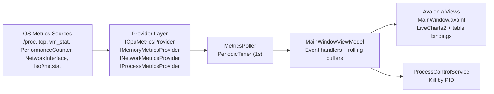

# ResourceRadar Architecture

This document describes how ResourceRadar is structured, how telemetry flows from the operating system to the UI, and where to extend the system safely.

## 1) System overview

ResourceRadar is a desktop dashboard with a layered architecture:

- Presentation layer: Avalonia UI + MVVM (`src/ResourceRadar.App`)
- Monitoring layer: providers + poller + models (`src/ResourceRadar.Monitoring`)

The app runs a background poll loop every second, collects samples, then updates UI-bound view state on the Avalonia UI thread.



## 2) Project boundaries

### `src/ResourceRadar.App`

Responsibilities:

- App startup and DI composition
- View models and commands
- XAML layout, binding, and theming

Key files:

- `src/ResourceRadar.App/Program.cs`
- `src/ResourceRadar.App/App.axaml.cs`
- `src/ResourceRadar.App/Services/ServiceRegistration.cs`
- `src/ResourceRadar.App/ViewModels/MainWindowViewModel.cs`
- `src/ResourceRadar.App/MainWindow.axaml`

### `src/ResourceRadar.Monitoring`

Responsibilities:

- Telemetry contracts and data models
- OS/provider-specific metric collection
- Polling orchestration
- Process termination service

Key files:

- `src/ResourceRadar.Monitoring/Abstractions/*`
- `src/ResourceRadar.Monitoring/Models/*`
- `src/ResourceRadar.Monitoring/MetricsPoller.cs`
- `src/ResourceRadar.Monitoring/Providers/*`

## 3) Runtime data flow

1. `ServiceRegistration` builds all providers and `MetricsPoller`.
2. `MainWindowViewModel` subscribes to poller events and starts polling (`1s`).
3. `MetricsPoller` collects CPU, memory, network, and process samples on a background thread.
4. ViewModel handlers post updates onto `Dispatcher.UIThread`.
5. Charts, labels, and process rows re-render via bindings.

## 4) Polling model

`MetricsPoller` uses:

- `PeriodicTimer` for cadence
- Linked `CancellationTokenSource` for controlled stop/disposal
- Event fan-out per sample type
- Exception event (`PollerFaulted`) so UI can surface telemetry errors

This keeps long-running metric collection out of the UI thread and centralizes lifecycle control.

## 5) Telemetry providers

### CPU

- Windows: `PerformanceCounter` (`Processor`, `% Processor Time`)
- Linux: `/proc/stat` parsed into snapshots and delta-based utilization
- macOS: `top -l 1 -n 0` parsed from command output

### Memory

- Windows: `GlobalMemoryStatusEx`
- Linux: `/proc/meminfo` (`MemTotal`, `MemAvailable` fallback to `MemFree`)
- macOS: `sysctl hw.memsize` + `vm_stat` page accounting

### Network

- Uses `NetworkInterface.GetAllNetworkInterfaces()`
- Aggregates active, non-loopback, non-tunnel adapters
- Computes upload/download rates from cumulative byte deltas over elapsed time

### Processes

Per process:

- PID, name, memory (`WorkingSet64`), CPU%
- CPU% computed from `TotalProcessorTime` deltas / elapsed wall time / core count

Traffic sort signal:

- `TrafficConnectionCount`
- Unix-like systems: parsed from `lsof -nP -i -F pf`
- Windows: parsed from `netstat -ano -p tcp/udp`
- Refreshed on a short cache interval to limit command overhead

Important: this is a traffic-activity proxy (connection count), not per-process bytes/sec.

## 6) UI composition

`MainWindowViewModel` holds:

- Rolling history buffers (CPU, memory, network download/upload)
- Chart series/axes definitions for LiveCharts2
- Formatted text projections for cards
- Process list state and sort commands
- End-process command (`IProcessControlService`)

Main UI regions in `MainWindow.axaml`:

- CPU card (line chart)
- Memory card (progress + chart)
- Network card (download/upload chart + labeled legend)
- Process table (sortable + terminate action)

## 7) Threading and responsiveness

- Sampling is non-UI (poller thread)
- UI mutations are marshaled via `Dispatcher.UIThread.Post`
- Chart buffers use bounded rolling windows (60 points)

This avoids UI stalls and unbounded growth.

## 8) Error handling strategy

- Providers catch and skip inaccessible/unsupported system artifacts where possible
- Poller catches provider exceptions and emits `PollerFaulted`
- ViewModel maps poller faults to `StatusMessage` for user visibility

## 9) Dependency injection and composition root

Composition root is in `src/ResourceRadar.App/Services/ServiceRegistration.cs`:

- Registers providers and poller as singletons
- Registers `MainWindowViewModel`
- Injects `MainWindowViewModel` as window `DataContext`

## 10) Extending the system

To add a new sensor (example: GPU):

1. Add model in `ResourceRadar.Monitoring/Models`
2. Add abstraction in `ResourceRadar.Monitoring/Abstractions`
3. Implement provider in `ResourceRadar.Monitoring/Providers`
4. Extend `IMetricsPoller` + `MetricsPoller`
5. Register provider in `ServiceRegistration`
6. Bind data in `MainWindowViewModel`
7. Add UI card/table section in `MainWindow.axaml`

## 11) Current constraints

- Process traffic is connection-count-based, not byte-throughput-based.
- Command-based providers depend on platform tools and permissions.
- Windows-only APIs trigger CA1416 warnings on non-Windows builds (expected in this architecture).

## 12) Build and run

```bash
dotnet restore ResourceRadar.sln
dotnet build ResourceRadar.sln
dotnet run --project src/ResourceRadar.App/ResourceRadar.App.csproj
```
